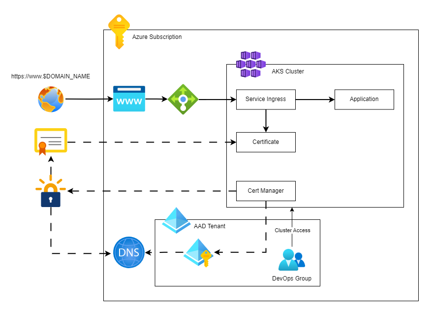

# AKS Certificate Management & AAD Access
This repository is a template written in Terraform (IaC) to deploy an AKS cluster with AAD authentication as well as production ready certificate management with Let's Encrypt. It features:
- AAD user and group management
- An AKS cluster
- AKS cluster access for AAD users by group assignment
- DNS Management
- Certificate management of the AKS cluster with Let's Encrypt
# Architecture


# How to deploy?
To deploy the architecture, follow these steps:
- Clone repo
- Create a Service Principal in Azure and use it to authenticate with the Azure Terraform module
- Create `prod.tfvars` with the string values: `client_id`, `client_secret` which relate to the user managed identity which handles the domain ownership proof
- Deploy the Terraform Module `terraform apply -var-file=prod.tfvars`
# Login to the cluster
In order to access the AKS cluster, the `kubelogin` library is used. Follow [the instructions](https://azure.github.io/kubelogin/concepts/login-modes/devicecode.html#usage-examples) to connect to a deployed cluster.

# Known Issues
- When connection to cluster fails as it tries to reach localhost
```
# Plan and apply the cluster module first
terraform plan -target=module.aks-cluster -var-file=prod.tfvars
terraform apply -target=module.aks-cluster -var-file=prod.tfvars -auto-approve

# Connection to the cluster should work now
terraform apply -var-file=prod.tfvars
```

# Resources
- [Setting up Let's Encrypt with AKS](https://cert-manager.io/docs/tutorials/getting-started-aks-letsencrypt/)
- [Kubelogin Docs](https://azure.github.io/kubelogin/install.html)